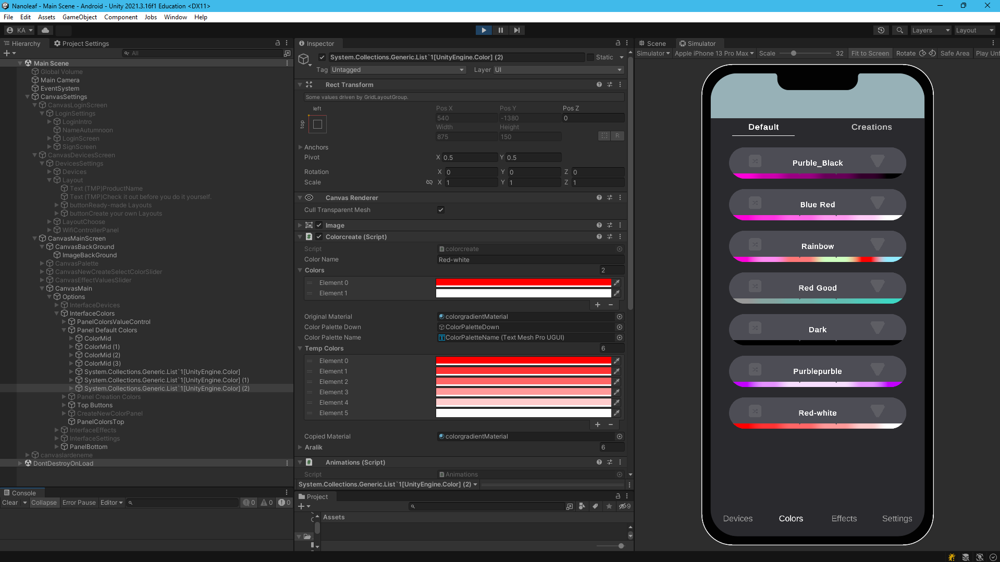
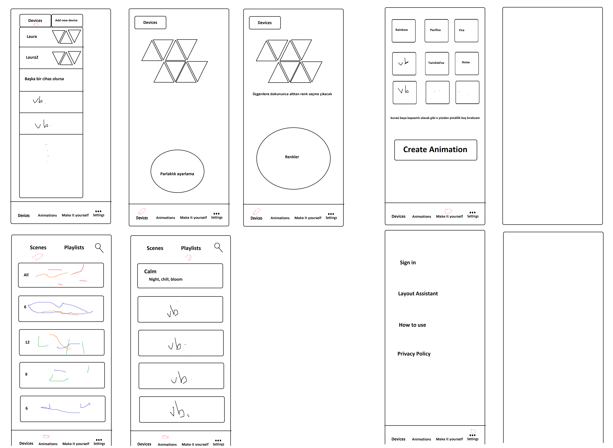
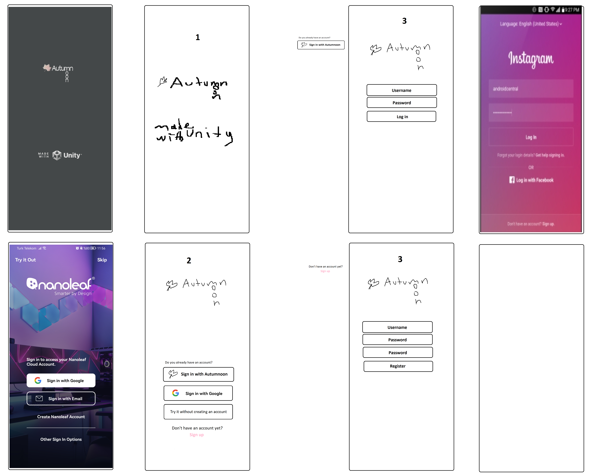

# 🌟 Led Control with Unity & ESP8266

## 🚀 Proje Hakkında
Bu proje, **Unity** ve **ESP8266** kullanarak WiFi üzerinden LED kontrolü sağlamayı amaçlıyor! 🎮💡

Şu an **tam olarak çalışmıyor** (hatta birkaç hata var 🤦‍♂️), ancak bir **prototip** olarak düşünülebilir. ESP8266'ya bağlanarak LED'lerin rengini değiştirebiliyoruz ve Unity üzerinden kontrol edebiliyoruz. 🖥️📡✨

## 📂 Proje Yapısı

```
/LedControlProject
    /Autumnoon_UnityApp   -> Unity projesi
    /ESP8266_Firmware     -> ESP8266 kodları
    /assets               -> Görseller ve GIF'ler
    README.md             -> Bu dosya 😄
```

### 🎮 Autumnoon_UnityApp
Bu klasör, **Unity uygulamamızı** içeriyor. Uygulama aracılığıyla ESP8266'ya bağlanıp LED'leri kontrol edebiliyoruz. Renk seçimi, bağlantı işlemleri ve temel UI burada bulunuyor. 

<div align="center">
    
</div>

### 🔧 ESP8266_Firmware
Bu klasör, **ESP8266 için yazılmış firmware** dosyalarını içeriyor. Burada, her dosyanın farklı bir görevi var:

- **`main.ino`** → ESP8266'nın temel çalışma mantığını içeren ana dosya. 📜
- **`wifiunitycontrol.h`** → Unity ile ESP arasındaki WiFi bağlantısını yönetiyor. 📡
- **`ledanimationscontrol.h`** → LED animasyonlarını kontrol eden kodları içeriyor. 🌈✨
- **`lauraanimationlibrary.h`** → LED efektleri için yazılmış özel bir kütüphane. 🏗️

### 🎨 Kullanıcı Arayüzü
Bağlantı ekranı ve ana ekranın nasıl göründüğüne dair bazı GIF'ler aşağıda:

<div align="center">
    
    
</div>

### 📌 Diğer Görseller

<div align="center">
    
    
    
</div>


## ⚠️ Şu Anki Durum
✅ ESP8266'ya bağlanabiliyoruz.  
✅ LED’leri **kontrol edebiliyoruz** (ama bazen çalışmıyor 😅).  
❌ Stabil değil, bazen bağlantı sorunları yaşanıyor.  
❌ Kodların iyileştirilmesi ve hata ayıklama yapılması gerekiyor.  

## 📌 Gelecekte Neler Yapılabilir?
- Daha stabil bir bağlantı sistemi oluşturulabilir. 🛠️
- Unity tarafındaki UI geliştirilebilir. 🎨
- Daha fazla LED animasyonu eklenebilir. 🎆

Bu projeyi geliştirmek isteyenler için kapımız açık! 👐 PR’larınızı bekliyoruz. 🚀

---
✨ **Eğlenceli kodlamalar!** 💻💡

